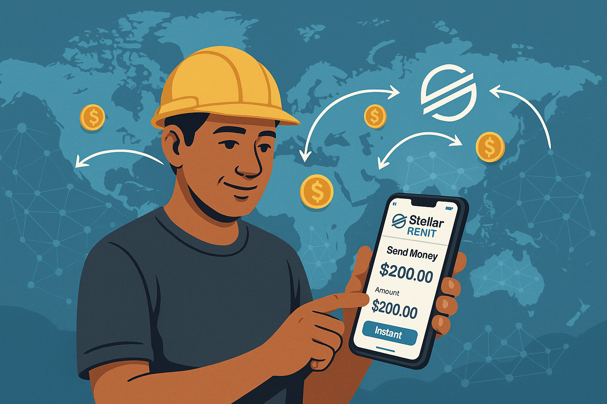

# 🌟 StellarRemit: AI-Powered Smart Remittance Platform


## 👨‍💻 About Me
- Name: Osman Yelek
- Blockchain Developer & Java Developer
- Passionate about DeFi and Smart Contracts
- Experienced in Stellar Network Development
- Backend Developer
- Open Source Contributor
- Tech Innovator

## 🚀 Project Overview
StellarRemit is an innovative remittance platform that combines the power of Stellar blockchain with artificial intelligence to revolutionize cross-border payments. The platform offers intelligent transaction timing, automated compliance checks, and real-time market analysis to ensure optimal transfer conditions.

## 💫 Vision
Our vision is to democratize cross-border payments by making them faster, cheaper, and more intelligent. By leveraging AI and blockchain technology, we aim to eliminate traditional banking barriers and create a seamless global payment ecosystem that benefits everyone, especially those in underserved regions.

## 🛠️ Development Plan
1. Smart Contract Development
   - Payment processing functions
   - Trustline management
   - Balance tracking
   - Transaction validation

2. AI Integration
   - Price prediction models
   - Transaction timing optimization
   - Risk assessment algorithms
   - Market analysis tools

3. Backend Development
   - RESTful API endpoints
   - Database integration
   - Security implementation
   - Performance optimization

4. Frontend Development
   - User-friendly interface
   - Real-time transaction tracking
   - Interactive dashboards
   - Mobile responsiveness

5. Testing & Security
   - Smart contract audits
   - Penetration testing
   - Performance testing
   - Security hardening

6. Deployment & Launch
   - Staging environment setup
   - Production deployment
   - Monitoring implementation
   - Documentation completion

## 🎯 Personal Story
As a blockchain developer passionate about financial inclusion, I created StellarRemit to address the challenges of traditional remittance systems. My experience with cross-border payments and AI led me to develop a solution that combines cutting-edge technology with practical usability.

## 🚀 Installation Guide

### Prerequisites
- Node.js (v14 or higher)
- MongoDB
- Stellar Testnet Account

### Setup Steps
1. Clone the repository:
```bash
git clone https://github.com/yourusername/stellar-remit.git
cd stellar-remit
```

2. Install dependencies:
```bash
npm install
```

3. Configure environment variables:
```bash
cp .env.example .env
# Edit .env with your configuration
```

4. Start the development server:
```bash
npm run dev
```

5. Access the application:
```
http://localhost:3000
```

## 🐂 Project Mascot
Our mascot, the Bull, represents strength, growth, and prosperity in the financial world. It symbolizes our commitment to creating abundance and exploring new frontiers in the realm of cross-border payments.

## 📝 License
MIT License - See LICENSE file for details 